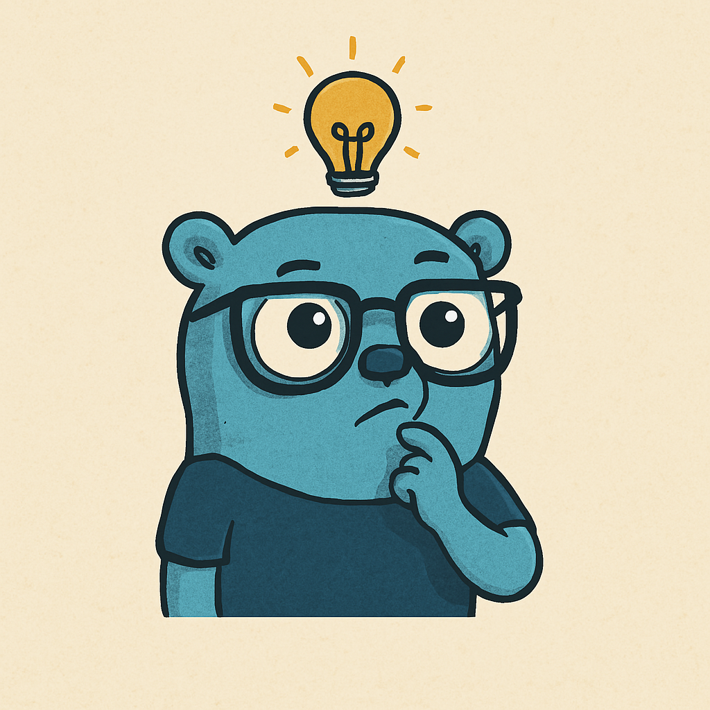

<p align="center">
  
</p>

# gothought

A lightweight, intuitive library for building LLM-powered applications and agents in Go.

## What is gothought?

gothought provides a simple, fluent API for interacting with Large Language Models and building LLM agents with tools. Unlike more complex frameworks, gothought focuses on minimizing boilerplate code while maintaining flexibility and extensibility.

```go
// Initialize with an OpenAI provider
provider := gothought.NewOpenAIProvider("gpt-4o", os.Getenv("OPENAI_API_KEY"), 0.7)

// Create a language model with the provider
model := gothought.NewLanguageModel(provider)

// Build your prompt chain and execute
response, err := model.
    SystemPrompt("You are a helpful assistant.").
    HumanPrompt("Tell me about Go programming.").
    Q(context.Background())
```

## Why gothought?

While solutions like langchain-go offer comprehensive features, they often require significant configuration and understanding of complex abstractions. gothought aims to solve common challenges in LLM application development with:

- **Minimal Setup**: Get started with just a few lines of code
- **Fluent API**: Intuitive chain-style syntax for building prompts
- **Extensible Design**: Support for multiple LLM providers through a unified interface
- **Type Safety**: Leverage Go's type system for reliable code
- **Tool Integration**: Easily add tools for building capable agents
- **Centralized Agent Loop**: Simplified agent architecture with provider-agnostic design

## Features

- Simple, chainable API for prompt construction
- Support for different message roles (system, human, AI)
- Provider interface for easy provider implementation
- Functional options for flexible configuration
- Agent loop for tool-using LLM applications
- Streaming support for real-time responses
- Multiple LLM providers (OpenAI, with more coming soon)
- Tool interface for extending LLM capabilities

## Installation

```bash
go get github.com/gobenpark/gothought
```

## Quickstart

```go
package main

import (
    "context"
    "fmt"
    "os"
    
    "github.com/gobenpark/gothought"
)

func main() {
    // Initialize provider with model, API key and temperature
    provider := gothought.NewOpenAIProvider(
        "gpt-4o", 
        os.Getenv("OPENAI_API_KEY"),
        0.7,
    )
    
    // Create language model with the provider
    model := gothought.NewLanguageModel(provider)
    
    // Build your prompt chain and execute
    response, err := model.
        SystemPrompt("You are a helpful coding assistant.").
        HumanPrompt("How do I read a file in Go?").
        Q(context.Background())
        
    if err != nil {
        fmt.Println("Error:", err)
        return
    }
    
    fmt.Println("Response:", response.Message)
}
```

### Using Tools with the LLM

```go
// Initialize provider
provider := gothought.NewOpenAIProvider(
    "gpt-4o", 
    os.Getenv("OPENAI_API_KEY"),
    0.7,
)

// Create language model
model := gothought.NewLanguageModel(provider)

// Add a tool to the model
braveSearchTool := tool.NewBraveSearchTool(os.Getenv("BRAVE_API_KEY"))
model.AddTool(braveSearchTool)

// Now the LLM can use the tool to answer questions
response, err := model.
    SystemPrompt("You are a helpful assistant with access to search tools.").
    HumanPrompt("What were the major tech news headlines yesterday?").
    Q(context.Background())
```

### Streaming Responses

```go
// Initialize provider
provider := gothought.NewOpenAIProvider(
    "gpt-4o", 
    os.Getenv("OPENAI_API_KEY"),
    0.7,
)

// Create language model
model := gothought.NewLanguageModel(provider)

// Use streaming API
err := model.
    SystemPrompt("You are a helpful assistant.").
    HumanPrompt("Tell me a story about space exploration.").
    QStream(context.Background(), func(msg gothought.Message) error {
        fmt.Print(msg.Message) // Print message chunks as they arrive
        return nil
    })
```

## Supported LLM Providers

- OpenAI (ChatGPT, GPT-4, GPT-4o)
- More providers coming soon!

## Supported Tools

- Brave Search - Web search capabilities
- Custom tools - Easily implement your own tools by implementing the Tool interface

## Creating Custom Tools

Extending the LLM with custom tools is simple:

```go
// Implement the Tool interface
type MyCustomTool struct {
    // Your tool fields
}

func (t *MyCustomTool) Name() string {
    return "my_custom_tool"
}

func (t *MyCustomTool) Description() string {
    return "A custom tool that does something useful"
}

func (t *MyCustomTool) ParameterSchema() map[string]interface{} {
    return map[string]interface{}{
        "type": "object",
        "properties": map[string]interface{}{
            "input": map[string]interface{}{
                "type": "string",
                "description": "The input for the tool",
            },
        },
        "required": []string{"input"},
    }
}

func (t *MyCustomTool) Call(ctx context.Context, params string) (string, error) {
    // Parse params and implement your tool logic
    var request struct {
        Input string `json:"input"`
    }
    if err := json.Unmarshal([]byte(params), &request); err != nil {
        return "", err
    }
    
    // Do something with request.Input
    result := "Processed: " + request.Input
    
    return result, nil
}
```

## Roadmap

Future plans for gothought include:

- Context management for multi-turn conversations
- Additional LLM providers (Claude, Gemini, Cohere, etc.)
- More built-in tools for common tasks
- Middleware support for request/response processing
- Function calling for non-tool providers
- Caching mechanisms
- Prompt templates
- Token counting and management
- Rate limiting and retry strategies
- Tool validation and error handling improvements

## Contributing

Contributions, suggestions, and feature requests are welcome! Feel free to open issues or submit pull requests as the project evolves.